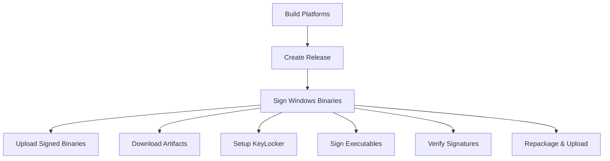

# Windows Code Signing with DigiCert KeyLocker in Buildkite

This directory contains the implementation for Windows code signing using DigiCert KeyLocker in the Buildkite CI pipeline.

## Overview

The Windows signing process automatically runs after each successful release build on the main branch. It downloads Windows binaries from Buildkite artifacts, signs them with DigiCert KeyLocker, and uploads the signed versions to the GitHub release.

## Files

- **`scripts/sign-windows.sh`** - Main Windows signing script
- **`scripts/test-windows-signing.sh`** - Test script for validating setup
- **`ci.mjs`** - Updated to include Windows signing step
- **`README-windows-signing.md`** - This documentation

## Architecture



## Required Buildkite Secrets

Configure these secrets in your Buildkite organization:

### DigiCert KeyLocker Secrets

| Secret Name | Description | Example |
|-------------|-------------|---------|
| `SM_API_KEY` | DigiCert Software Trust Manager API key | `abc123def456...` |
| `SM_HOST` | DigiCert Software Trust Manager host URL | `https://clientauth.one.digicert.com` |
| `SM_CLIENT_CERT_FILE_B64` | Base64-encoded client certificate (.p12) | `MIIKlAIBAzCCCk4GCSqGSIb3...` |
| `SM_CLIENT_CERT_PASSWORD` | Password for the client certificate | `MySecurePassword123!` |
| `SM_CODE_SIGNING_CERT_SHA1_HASH` | SHA1 fingerprint of code signing certificate | `a1b2c3d4e5f6789012345678901234567890abcd` |

### Existing Required Secrets

| Secret Name | Description |
|-------------|-------------|
| `GITHUB_TOKEN` | GitHub token for uploading release assets |

## Setup Instructions

### 1. DigiCert KeyLocker Setup

#### 1.1 Create API Token
1. Log into [DigiCert CertCentral](https://www.digicert.com/account/)
2. Go to **Account** → **API Keys**
3. Create a new API key for "Buildkite CI"
4. Copy the API key → `SM_API_KEY`

#### 1.2 Download Client Certificate
1. In DigiCert CertCentral, go to **Software Trust Manager** → **Certificates**
2. Download your client authentication certificate in PKCS#12 (.p12) format
3. Set a password when prompted → `SM_CLIENT_CERT_PASSWORD`

#### 1.3 Get Code Signing Certificate Fingerprint
1. Go to **Software Trust Manager** → **Certificates**
2. Find your code signing certificate (not the client auth cert)
3. Copy the SHA1 fingerprint → `SM_CODE_SIGNING_CERT_SHA1_HASH`

#### 1.4 Convert Certificate to Base64
```bash
# On macOS/Linux
base64 -i client-certificate.p12 -o client-certificate.p12.base64

# On Windows PowerShell
[Convert]::ToBase64String([IO.File]::ReadAllBytes("client-certificate.p12")) | Out-File -Encoding ascii client-certificate.p12.base64
```
The content of the `.base64` file → `SM_CLIENT_CERT_FILE_B64`

### 2. Buildkite Configuration

#### 2.1 Add Secrets
In your Buildkite organization settings:
1. Go to **Settings** → **Secrets**
2. Add each secret from the table above
3. Ensure secrets are available to the pipeline

#### 2.2 Windows Agent Queue
Ensure you have Windows agents in a queue named `windows`:
- Agents must run on Windows (Windows Server 2019+ recommended)
- Agents need internet access for DigiCert KeyLocker
- Agents should have PowerShell and basic utilities installed

### 3. Testing the Setup

#### 3.1 Test Environment
Run the test script to validate configuration:
```bash
# On a Windows Buildkite agent
.buildkite/scripts/test-windows-signing.sh
```

#### 3.2 Manual Test
Test signing manually with a specific version:
```bash
# Sign a specific release
.buildkite/scripts/sign-windows.sh canary

# Sign a tagged release  
.buildkite/scripts/sign-windows.sh 1.2.3
```

## How It Works

### 1. Pipeline Integration
- Windows signing step added to `ci.mjs` after the release step
- Runs only on main branch builds
- Uses Windows agent queue
- Depends on successful release step

### 2. Signing Process
1. **Download**: Downloads Windows binaries from Buildkite artifacts
2. **Extract**: Unzips each Windows binary package
3. **Setup**: Configures DigiCert KeyLocker environment
4. **Install**: Downloads and installs DigiCert SMCTL tools
5. **Sign**: Signs all `.exe` files using `smctl` with certificate fingerprint
6. **Verify**: Verifies signatures using `signtool`
7. **Package**: Repackages signed binaries into zip files
8. **Upload**: Uploads signed packages to GitHub release (replacing unsigned versions)

### 3. Binaries Signed
- `bun-windows-x64.zip`
- `bun-windows-x64-profile.zip`
- `bun-windows-x64-baseline.zip` 
- `bun-windows-x64-baseline-profile.zip`

All `.exe` files within these packages are signed.

## Security Features

- **Certificate Security**: Client certificate stored as base64-encoded secret
- **Temporary Files**: Certificate files automatically cleaned up after signing
- **MFA**: DigiCert KeyLocker enforces multi-factor authentication
- **Audit Trail**: Complete signing logs in DigiCert and Buildkite
- **Verification**: All signatures verified before upload
- **Access Control**: Buildkite secrets limit access to signing capabilities

## Troubleshooting

### Common Issues

**"Cannot find smctl"**
- Ensure Windows agent has internet access
- Check DigiCert tool installation process
- Verify Windows agent compatibility

**"DigiCert KeyLocker health check failed"**
- Check `SM_HOST` URL is correct
- Verify `SM_API_KEY` is valid and not expired
- Ensure client certificate and password are correct

**"Certificate fingerprint not found"**
- Verify `SM_CODE_SIGNING_CERT_SHA1_HASH` matches exactly
- Check certificate is active in DigiCert KeyLocker
- Ensure certificate is a code signing certificate

**"Buildkite artifact not found"**
- Ensure release step completed successfully
- Check artifact names match expected Windows binaries
- Verify build platforms include Windows targets

### Debug Steps

1. **Check Buildkite logs**: Look for detailed error messages in the signing step
2. **Test manually**: Run test script on Windows agent to isolate issues
3. **Verify secrets**: Ensure all required secrets are set and accessible
4. **Check DigiCert**: Verify KeyLocker status and certificate validity

### Getting Help

- **DigiCert Support**: For KeyLocker and certificate issues
- **Buildkite Support**: For agent and pipeline issues
- **Run test script**: Use `test-windows-signing.sh` for diagnostic information

## Monitoring

### Success Indicators
- ✅ All Windows binaries downloaded from artifacts
- ✅ DigiCert KeyLocker connection successful
- ✅ All `.exe` files signed and verified
- ✅ Signed binaries uploaded to GitHub release

### Logs to Monitor
- DigiCert KeyLocker health checks
- Certificate fingerprint verification
- Signing operation success/failure
- GitHub upload confirmation

## Maintenance

### Regular Tasks
- **Certificate Renewal**: Update certificate secrets when certificates expire
- **API Key Rotation**: Rotate DigiCert API keys periodically
- **Agent Updates**: Keep Windows agents updated with latest tools

### Updates
- **DigiCert Tools**: SMCTL tools are downloaded fresh for each signing operation
- **Scripts**: Update scripts in this repository for any changes
- **Documentation**: Keep this README updated with any configuration changes