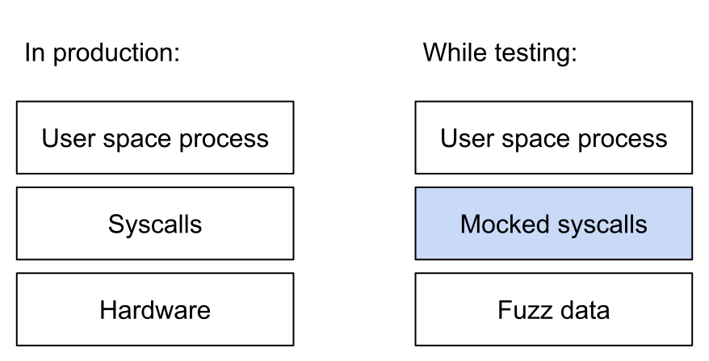

# libEpollFuzzer - fuzzing for Linux servers

This mock implementation of the [epoll/socket](https://en.wikipedia.org/wiki/Epoll) syscalls allows you to test intricate edge cases and find bugs in mission critical software - all within minutes. It builds on LLVM's [libFuzzer](http://llvm.org/docs/LibFuzzer.html) and operates based on nothing but fuzz data, being entirely deterministic and reproducible.

Where [syzkaller](https://github.com/google/syzkaller) is a *user space process* fuzzing the **kernel**, libEpollFuzzer is mocking the *kernel* and fuzzing the **user space process**.

## Can you find the bug?

The following code runs fine in most cases but has a critical security bug that can be hard to trigger - can you find it?

```c++
int epfd = epoll_create1();

int lsfd = listen(asdasdasd);

int ready_fd = epoll_wait(epfd, lalalala);

for (all ready fds)

int length = recv(buf, 24234234);

//copy from 0 and length
```

## Let's find it!

gif here of finding the bug

## A more complex case
Fuzzing the entire uSockets library takes no more than a few linker flags. Other libraries that may benefit from fuzzing include libuv, libev, libevent, ASIO and the like.

## How it works



Any user space process will communicate with the kernel via syscalls. While possible for the kernel to trigger user space signals, these are typically not used to communicate fine grained events. Instead the user space process will "pull" events in batches from the kernel in "event-loop iterations". This by calling the potentially blocking syscall epoll_wait. When the kernel resumes user space execution, the process will continue to process the events and run callbacks/co-routines as it wishes. Data is then "pushed" to kernel space by calls to send, write, etc. This completes the primary input/output cycle.

Linking to libEpollFuzzer, certain syscalls are wrapped at the linker stage. These calls, as made by the server, then run mock variants where fuzz data from libFuzzer is used to control the outcome / result. Because the fuzz data is randomly evolving based on coverage, so does the execution order / behavior of your entire async server. Hence, it is possible to easily uncover edge cases such as the one presented above - cases which might be hard to trigger in real-world use cases or testing.
