# **Bun Streams Architecture: High-Performance I/O in JavaScript**

### **Table of Contents**

1.  [**Overview & Core Philosophy**](#1-overview--core-philosophy)
2.  [**Foundational Concepts**](#2-foundational-concepts)
    - 2.1. The Stream Tagging System: Enabling Optimization
    - 2.2. The `Body` Mixin: An Intelligent Gateway
3.  [**Deep Dive: The Major Performance Optimizations**](#3-deep-dive-the-major-performance-optimizations)
    - 3.1. Optimization 1: Synchronous Coercion - Eliminating Streams Entirely
    - 3.2. Optimization 2: The Direct Path - Zero-Copy Native Piping
    - 3.3. Optimization 3: `readMany()` - Efficient Async Iteration
4.  [**Low-Level Implementation Details**](#4-low-level-implementation-details)
    - 4.1. The Native Language: `streams.zig` Primitives
    - 4.2. Native Sink In-Depth: `HTTPSResponseSink` and Buffering
    - 4.3. The Native Collector: `Body.ValueBufferer`
    - 4.4. Memory and String Optimizations
5.  [**The Unified System: A Complete Data Flow Example**](#5-the-unified-system-a-complete-data-flow-example)
6.  [**Conclusion**](#6-conclusion)

---

## 1. Overview & Core Philosophy

Streams in Bun makes I/O performance in JavaScript competitive with lower-level languages like Go, Rust, and C, while presenting a fully WHATWG-compliant API.

The core philosophy is **"native-first, JS-fallback"**. Bun assumes that for many high-performance use cases, the JavaScript layer should act as a high-level controller for system-level I/O operations. We try to execute I/O operations with minimal abstraction cost, bypassing the JavaScript virtual machine entirely for performance-critical paths.

This document details the specific architectural patterns, from the JS/native boundary down to the I/O layer, that enable this level of performance.

## 2. Foundational Concepts

To understand Bun's stream optimizations, two foundational concepts must be understood first: the tagging system and the `Body` mixin's role as a state machine.

### 2.1. The Stream Tagging System: Enabling Optimization

Identifying the _source_ of a `ReadableStream` at the native level unlocks many optimization opportunities. This is achieved by "tagging" the stream object internally.

- **Mechanism:** Every `ReadableStream` in Bun holds a private field, `bunNativePtr`, which can point to a native Zig struct representing the stream's underlying source.
- **Identification:** A C++ binding, `ReadableStreamTag__tagged` (from `ReadableStream.zig`), is the primary entry point for this identification. When native code needs to consume a stream (e.g., when sending a `Response` body), it calls this function on the JS `ReadableStream` object to determine its origin.

```zig
// src/bun.js/webcore/ReadableStream.zig
pub const Tag = enum(i32) {
    JavaScript = 0, // A generic, user-defined stream. This is the "slow path".
    Blob = 1,       // An in-memory blob. Fast path available.
    File = 2,       // Backed by a native file reader. Fast path available.
    Bytes = 4,      // Backed by a native network byte stream. Fast path available.
    Direct = 3,     // Internal native-to-native stream.
    Invalid = -1,
};
```

This tag is the key that unlocks all subsequent optimizations. It allows the runtime to dispatch to the correct, most efficient implementation path.

### 2.2. The `Body` Mixin: An Intelligent Gateway

The `Body` mixin (used by `Request` and `Response`) is not merely a stream container; it's a sophisticated state machine and the primary API gateway to Bun's optimization paths. A `Body`'s content is represented by the `Body.Value` union in Zig, which can be a static buffer (`.InternalBlob`, `.WTFStringImpl`) or a live stream (`.Locked`).

Methods like `.text()`, `.json()`, and `.arrayBuffer()` are not simple stream consumers. They are entry points to a decision tree that aggressively seeks the fastest possible way to fulfill the request.

```mermaid
stateDiagram-v2
    direction TB
    [*] --> StaticBuffer : new Response("hello")

    state StaticBuffer {
        [*] --> Ready
        Ready : Data in memory
        Ready : .WTFStringImpl | .InternalBlob
    }

    StaticBuffer --> Locked : Access .body
    StaticBuffer --> Used : .text() ⚡

    state Locked {
        [*] --> Streaming
        Streaming : ReadableStream created
        Streaming : Tagged (File/Bytes/etc)
    }

    Locked --> Used : consume stream
    Used --> [*] : Complete

    note right of StaticBuffer
        Fast Path
        Skip streams entirely!
    end note

    note right of Locked
        Slow Path
        Full streaming
    end note

    classDef buffer fill:#fbbf24,stroke:#92400e,stroke-width:3px,color:#451a03
    classDef stream fill:#60a5fa,stroke:#1e40af,stroke-width:3px,color:#172554
    classDef final fill:#34d399,stroke:#14532d,stroke-width:3px,color:#052e16

    class StaticBuffer buffer
    class Locked stream
    class Used final
```



**Diagram 1: `Body.Value` State Transitions**

## 3. Deep Dive: The Major Performance Optimizations

### 3.1. Optimization 1: Synchronous Coercion - Eliminating Streams Entirely

This is the most impactful optimization for a vast number of common API and data processing tasks.

**The Conventional Problem:** In other JavaScript runtimes, consuming a response body with `.text()` is an inherently asynchronous, multi-step process involving the creation of multiple streams, readers, and promises, which incurs significant overhead.

**Bun's fast path:** Bun correctly assumes that for many real-world scenarios (e.g., small JSON API responses), the entire response body is already available in a single, contiguous memory buffer when the consuming method is called. It therefore **bypasses the entire stream processing model** and returns the buffer directly.

**Implementation Architecture & Data Flow:**



```mermaid
flowchart TB
    A["response.text()"] --> B{Check Body Type}

    B -->|"✅ Already Buffered<br/>(InternalBlob, etc.)"|C[⚡ FAST PATH]
    B -->|"❌ Is Stream<br/>(.Locked)"|D[🐌 SLOW PATH]

    subgraph fast[" "]
        C --> C1[Get buffer pointer]
        C1 --> C2[Decode to string]
        C2 --> C3[Return resolved Promise]
    end

    subgraph slow[" "]
        D --> D1[Create pending Promise]
        D1 --> D2[Setup native buffering]
        D2 --> D3[Collect all chunks]
        D3 --> D4[Decode & resolve Promise]
    end

    C3 --> E["✨ Result available immediately<br/>(0 async operations)"]
    D4 --> F["⏳ Result after I/O completes<br/>(multiple async operations)"]

    style fast fill:#dcfce7,stroke:#166534,stroke-width:3px
    style slow fill:#fee2e2,stroke:#991b1b,stroke-width:3px
    style C fill:#22c55e,stroke:#166534,stroke-width:3px,color:#14532d
    style C1 fill:#86efac,stroke:#166534,stroke-width:2px,color:#14532d
    style C2 fill:#86efac,stroke:#166534,stroke-width:2px,color:#14532d
    style C3 fill:#86efac,stroke:#166534,stroke-width:2px,color:#14532d
    style D fill:#ef4444,stroke:#991b1b,stroke-width:3px,color:#ffffff
    style D1 fill:#fca5a5,stroke:#991b1b,stroke-width:2px,color:#450a0a
    style D2 fill:#fca5a5,stroke:#991b1b,stroke-width:2px,color:#450a0a
    style D3 fill:#fca5a5,stroke:#991b1b,stroke-width:2px,color:#450a0a
    style D4 fill:#fca5a5,stroke:#991b1b,stroke-width:2px,color:#450a0a
    style E fill:#166534,stroke:#14532d,stroke-width:4px,color:#ffffff
    style F fill:#dc2626,stroke:#991b1b,stroke-width:3px,color:#ffffff
```

**Diagram 2: Synchronous Coercion Logic Flow**

1.  **Entry Point:** A JS call to `response.text()` triggers `readableStreamToText` (`ReadableStream.ts`), which immediately calls `tryUseReadableStreamBufferedFastPath`.
2.  **Native Check:** `tryUseReadableStreamBufferedFastPath` calls the native binding `jsFunctionGetCompleteRequestOrResponseBodyValueAsArrayBuffer` (`Response.zig`).
3.  **State Inspection:** This native function inspects the `Body.Value` tag. If the tag is `.InternalBlob`, `.Blob` (and not a disk-backed file), or `.WTFStringImpl`, the complete data is already in memory.
4.  **Synchronous Data Transfer:** The function **synchronously** returns the underlying buffer as a native `ArrayBuffer` handle to JavaScript. The `Body` state is immediately transitioned to `.Used`. The buffer's ownership is often transferred (`.transfer` lifetime), avoiding a data copy.
5.  **JS Resolution:** The JS layer receives a promise that is **already fulfilled** with the complete `ArrayBuffer`. It then performs the final conversion (e.g., `TextDecoder.decode()`) in a single step.

**Architectural Impact:** This optimization transforms a complex, multi-tick asynchronous operation into a single, synchronous native call followed by a single conversion step. The performance gain is an order of magnitude or more, as it eliminates the allocation and processing overhead of the entire stream and promise chain.

### 3.2. Optimization 2: The Direct Path - Zero-Copy Native Piping

This optimization targets high-throughput scenarios like serving files or proxying requests, where both the data source and destination are native.

**The Conventional Problem:** Piping a file to an HTTP response in other runtimes involves a costly per-chunk round trip through the JavaScript layer: `Native (read) -> JS (chunk as Uint8Array) -> JS (response.write) -> Native (socket)`.

**Bun's direct path:** Bun's runtime inspects the source and sink of a pipe. If it identifies a compatible native pair, it establishes a direct data channel between them entirely within the native layer.

**Implementation Architecture & Data Flow:**



```mermaid
%%{init: {'theme':'base', 'themeVariables': {'primaryColor':'#2563eb','primaryTextColor':'#fff','primaryBorderColor':'#3b82f6','lineColor':'#94a3b8','secondaryColor':'#fbbf24','background':'#f8fafc','mainBkg':'#ffffff','secondBkg':'#f1f5f9'}}}%%
graph TD
    subgraph " "
        subgraph js["🟨 JavaScript Layer"]
            C["📄 new Response(file.stream())"]
        end
        subgraph native["⚡ Native Layer (Zig)"]
            A["💾 Disk I/O<br><b>FileReader Source</b>"]
            B["🔌 Socket Buffer<br><b>HTTPSResponseSink</b>"]
            A -."🚀 Zero-Copy View<br>streams.Result.temporary".-> B
            B -."🔙 Backpressure Signal".-> A
        end
    end
    B ==>|"📡 Send"|D["🌐 Network"]
    C ==>|"Direct Native<br>Connection"|A

    style js fill:#fef3c7,stroke:#92400e,stroke-width:3px,color:#451a03
    style native fill:#dbeafe,stroke:#1e40af,stroke-width:3px,color:#172554
    style A fill:#60a5fa,stroke:#1e40af,stroke-width:2px,color:#172554
    style B fill:#60a5fa,stroke:#1e40af,stroke-width:2px,color:#172554
    style C fill:#fbbf24,stroke:#92400e,stroke-width:2px,color:#451a03
    style D fill:#22c55e,stroke:#166534,stroke-width:2px,color:#ffffff

    classDef jsClass fill:#fef3c7,stroke:#f59e0b,stroke-width:2px
    classDef nativeClass fill:#dbeafe,stroke:#3b82f6,stroke-width:2px
    classDef networkClass fill:#d1fae5,stroke:#10b981,stroke-width:2px
```

**Diagram 3: Direct Path for File Serving**

1.  **Scenario:** A server handler returns `new Response(Bun.file("video.mp4").stream())`.
2.  **Tagging:** The stream is created with a `File` tag, and its `bunNativePtr` points to a native `webcore.FileReader` struct. The HTTP server's response sink is a native `HTTPSResponseSink`.
3.  **Connection via `assignToStream`:** The server's internal logic triggers `assignToStream` (`ReadableStreamInternals.ts`). This function detects the native source via its tag and dispatches to `readDirectStream`.
4.  **Native Handoff:** `readDirectStream` calls the C++ binding `$startDirectStream`, which passes pointers to the native `FileReader` (source) and `HTTPSResponseSink` (sink) to the Zig engine.
5.  **Zero-Copy Native Data Flow:** The Zig layer takes over. The `FileReader` reads a chunk from the disk. It yields a `streams.Result.temporary` variant, which is a **zero-copy view** into a shared read buffer. This view is passed directly to the `HTTPSResponseSink.write()` method, which appends it to its internal socket write buffer. When possible, Bun will skip the FileReader and use the `sendfile` system call for even less system call interactions.

**Architectural Impact:**

- **No Per-Chunk JS Execution:** The JavaScript event loop is not involved in the chunk-by-chunk transfer.
- **Zero Intermediate Copies:** Data moves from the kernel's page cache directly to the network socket's send buffer.
- **Hardware-Limited Throughput:** This architecture removes the runtime as a bottleneck, allowing I/O performance to be limited primarily by hardware speed.

### 3.3. Optimization 3: `readMany()` - Efficient Async Iteration

Bun optimizes the standard `for-await-of` loop syntax for streams.

**The Conventional Problem:** A naive `[Symbol.asyncIterator]` implementation calls `await reader.read()` for every chunk, which is inefficient if many small chunks arrive in quick succession.

**Bun's Solution:** Bun provides a custom, non-standard `reader.readMany()` method that synchronously drains the stream's entire internal buffer into a JavaScript array.

**Implementation Architecture & Data Flow:**



```mermaid
flowchart TB
    subgraph trad["Traditional for-await-of"]
        direction TB
        T1["🔄 for await (chunk of stream)"]
        T2["await read() → chunk1"]
        T3["Process chunk1"]
        T4["await read() → chunk2"]
        T5["Process chunk2"]
        T6["await read() → chunk3"]
        T7["..."]
        T1 --> T2 --> T3 --> T4 --> T5 --> T6 --> T7
    end

    subgraph bun["Bun's readMany() Optimization"]
        direction TB
        B1["🚀 for await (chunks of stream)"]
        B2["readMany()"]
        B3{"Buffer<br/>Status?"}
        B4["⚡ Return [c1, c2, c3]<br/>SYNCHRONOUS"]
        B5["Process ALL chunks<br/>in one go"]
        B6["await (only if empty)"]

        B1 --> B2
        B2 --> B3
        B3 -->|"Has Data"|B4
        B3 -->|"Empty"|B6
        B4 --> B5
        B5 --> B2
        B6 --> B2
    end

    trad --> P1["❌ Performance Impact<br/>• Promise per chunk<br/>• await per chunk<br/>• High overhead"]
    bun --> P2["✅ Performance Win<br/>• Batch processing<br/>• Minimal promises<br/>• Low overhead"]

    style trad fill:#fee2e2,stroke:#7f1d1d,stroke-width:3px
    style bun fill:#dcfce7,stroke:#14532d,stroke-width:3px
    style T2 fill:#ef4444,stroke:#7f1d1d,color:#ffffff
    style T4 fill:#ef4444,stroke:#7f1d1d,color:#ffffff
    style T6 fill:#ef4444,stroke:#7f1d1d,color:#ffffff
    style B4 fill:#22c55e,stroke:#14532d,stroke-width:3px,color:#ffffff
    style B5 fill:#22c55e,stroke:#14532d,stroke-width:3px,color:#ffffff
    style P1 fill:#dc2626,stroke:#7f1d1d,stroke-width:3px,color:#ffffff
    style P2 fill:#16a34a,stroke:#14532d,stroke-width:3px,color:#ffffff
```

**Diagram 4: `readMany()` Async Iterator Flow**

**Architectural Impact:** This pattern coalesces multiple chunks into a single macro-task. It drastically reduces the number of promise allocations and `await` suspensions required to process a stream, leading to significantly lower CPU usage and higher throughput for chunked data processing.

### **4. Low-Level Implementation Details**

The high-level optimizations are made possible by a robust and carefully designed native foundation in Zig.

#### **4.1. The Native Language: `streams.zig` Primitives**

The entire native architecture is built upon a set of generic, powerful Zig primitives that define the contracts for data flow.

- **`streams.Result` Union:** This is the universal data-carrying type for all native stream reads. Its variants are not just data containers; they are crucial signals from the source to the sink.
  - `owned: bun.ByteList`: Represents a heap-allocated buffer. The receiver is now responsible for freeing this memory. This is used when data must outlive the current scope.
  - `temporary: bun.ByteList`: A borrowed, read-only view into a source's internal buffer. This is the key to **zero-copy reads**, as the sink can process the data without taking ownership or performing a copy. It is only valid for the duration of the function call.
  - `owned_and_done` / `temporary_and_done`: These variants bundle the final data chunk with the end-of-stream signal. This is a critical latency optimization, as it collapses two distinct events (data and close) into one, saving an I/O round trip.
  - `into_array`: Used for BYOB (Bring-Your-Own-Buffer) readers. It contains a handle to the JS-provided `ArrayBufferView` (`value: JSValue`) and the number of bytes written (`len`). This confirms a zero-copy write directly into JS-managed memory.
  - `pending: *Pending`: A handle to a future/promise, used to signal that the result is not yet available and the operation should be suspended.

- **`streams.Signal` V-Table:** This struct provides a generic, type-erased interface (`start`, `ready`, `close`) for a sink to communicate backpressure and state changes to a source.
  - **`start()`**: Tells the source to begin producing data.
  - **`ready()`**: The sink calls this to signal it has processed data and is ready for more, effectively managing backpressure.
  - **`close()`**: The sink calls this to tell the source to stop, either due to completion or an error.
    This v-table decouples native components, allowing any native source to be connected to any native sink without direct knowledge of each other's concrete types, which is essential for the Direct Path optimization.

#### **4.2. Native Sink In-Depth: `HTTPSResponseSink` and Buffering**

The `HTTPServerWritable` struct (instantiated as `HTTPSResponseSink` in `streams.zig`) is part of what makes Bun's HTTP server fast.

- **Intelligent Write Buffering:** The `write` method (`writeBytes`, `writeLatin1`, etc.) does not immediately issue a `write` syscall. It appends the incoming `streams.Result` slice to its internal `buffer: bun.ByteList`. This coalesces multiple small, high-frequency writes (common in streaming LLM responses or SSE) into a single, larger, more efficient syscall.

- **Backpressure Logic (`send` method):** The `send` method attempts to write the buffer to the underlying `uWebSockets` socket.
  - It uses the optimized `res.tryEnd()` for the final chunk.
  - If `res.write()` or `res.tryEnd()` returns a "backpressure" signal, the sink immediately sets `this.has_backpressure = true` and registers an `onWritable` callback.
  - The `onWritable` callback is triggered by the OS/`uWebSockets` when the socket can accept more data. It clears the backpressure flag, attempts to send the rest of the buffered data, and then signals `ready()` back to the source stream via its `streams.Signal`. This creates a tight, efficient, native backpressure loop.

- **The Auto-Flusher (`onAutoFlush`):** This mechanism provides a perfect balance between throughput and latency.
  - **Mechanism:** When `write` is called but the `highWaterMark` is not reached, `registerAutoFlusher` queues a task that runs AFTER all JavaScript microtasks are completed.
  - **Execution:** The `onAutoFlush` method is executed by the event loop at the very end of the current tick, after all JavaScript microtasks are completed. It checks `!this.hasBackpressure()` and, if the buffer is not empty, calls `sendWithoutAutoFlusher` to flush the buffered data.
  - **Architectural Impact:** This allows multiple `writer.write()` calls within a single synchronous block of JS code to be batched into one syscall, but guarantees that the data is sent immediately after the current JS task completes, ensuring low, predictable latency for real-time applications.

#### **4.3. The Native Collector: `Body.ValueBufferer`**

When a consuming method like `.text()` is called on a body that cannot be resolved synchronously, the `Body.ValueBufferer` (`Body.zig`) is used to efficiently collect all chunks into a single native buffer.

- **Instantiation:** A `Body.ValueBufferer` is created with a callback, `onFinishedBuffering`, which will be invoked upon completion to resolve the original JS promise.
- **Native Piping (`onStreamPipe`):** For a `ByteStream` source, the bufferer sets itself as the `pipe` destination. The `ByteStream.onData` method, instead of interacting with JavaScript, now directly calls the bufferer's `onStreamPipe` function. This function appends the received `streams.Result` slice to its internal `stream_buffer`. The entire collection loop happens natively.
- **Completion:** When a chunk with the `_and_done` flag is received, `onStreamPipe` calls the `onFinishedBuffering` callback, passing the final, fully concatenated buffer. This callback then resolves the original JavaScript promise.

**Architectural Impact:** This pattern ensures that even when a body must be fully buffered, the collection process is highly efficient. Data chunks are concatenated in native memory without repeatedly crossing the JS boundary, minimizing overhead.

#### **4.4. Memory and String Optimizations**

- **`Blob` and `Blob.Store` (`Blob.zig`):** A `Blob` is a lightweight handle to a `Blob.Store`. The store can be backed by memory (`.bytes`), a file (`.file`), or an S3 object (`.s3`). This allows Bun to implement optimized operations based on the blob's backing store (e.g., `Bun.write(file1, file2)` becomes a native file copy via `copy_file.zig`).
- **`Blob.slice()` as a Zero-Copy View:** `blob.slice()` is a constant-time operation that creates a new `Blob` handle pointing to the same store but with a different `offset` and `size`, avoiding any data duplication.
- **`is_all_ascii` Flag:** `Blob`s and `ByteStream`s track whether their content is known to be pure ASCII. This allows `.text()` to skip expensive UTF-8 validation and decoding for a large class of text-based data, treating the Latin-1 bytes directly as a string.
- **`WTFStringImpl` Integration:** Bun avoids copying JS strings by default, instead storing a pointer to WebKit's internal `WTF::StringImpl` (`Body.Value.WTFStringImpl`). The conversion to a UTF-8 byte buffer is deferred until it's absolutely necessary (e.g., writing to a socket), avoiding copies for string-based operations that might never touch the network.

## 5. The Unified System: A Complete Data Flow Example

This diagram illustrates how the components work together when a `fetch` response is consumed.

```mermaid
%%{init: {'theme':'base', 'themeVariables': {'primaryColor':'#2563eb','primaryTextColor':'#fff','primaryBorderColor':'#3b82f6','lineColor':'#94a3b8','secondaryColor':'#fbbf24','tertiaryColor':'#a78bfa','background':'#f8fafc','mainBkg':'#ffffff','secondBkg':'#f1f5f9'}}}%%
graph TD
    subgraph flow["🚀 Response Consumption Flow"]
        A["📱 JS Code"] --> B{"🎯 response.text()"}
        B --> C{"❓ Is Body<br>Buffered?"}
        C -->|"✅ Yes"|D["⚡ Optimization 1<br>Sync Coercion"]
        C -->|"❌ No"|E{"❓ Is Stream<br>Native?"}
        D --> F(("📄 Final String"))

        E -->|"✅ Yes"|G["🚀 Optimization 2<br>Direct Pipe to<br>Native ValueBufferer"]
        E -->|"❌ No"|H["🐌 JS Fallback<br>read() loop"]

        G --> I{"💾 Native<br>Buffering"}
        H --> I

        I --> J["🔤 Decode<br>Buffer"]
        J --> F
    end

    subgraph Legend
        direction LR
        L1("🟨 JS Layer")
        L2("🟦 Native Layer")
        style L1 fill:#fef3c7,stroke:#f59e0b,stroke-width:2px,color:#92400e
        style L2 fill:#dbeafe,stroke:#3b82f6,stroke-width:2px,color:#1e40af
    end

    style flow fill:#f8fafc,stroke:#64748b,stroke-width:2px
    style A fill:#fef3c7,stroke:#f59e0b,stroke-width:2px,color:#92400e
    style B fill:#fef3c7,stroke:#f59e0b,stroke-width:2px,color:#92400e
    style H fill:#fee2e2,stroke:#ef4444,stroke-width:2px,color:#991b1b
    style C fill:#e0e7ff,stroke:#6366f1,stroke-width:2px,color:#4338ca
    style E fill:#e0e7ff,stroke:#6366f1,stroke-width:2px,color:#4338ca
    style D fill:#dbeafe,stroke:#3b82f6,stroke-width:3px,color:#1e40af
    style G fill:#dbeafe,stroke:#3b82f6,stroke-width:3px,color:#1e40af
    style I fill:#e0e7ff,stroke:#6366f1,stroke-width:2px,color:#4338ca
    style J fill:#e0e7ff,stroke:#6366f1,stroke-width:2px,color:#4338ca
    style F fill:#d1fae5,stroke:#10b981,stroke-width:4px,color:#065f46

```



**Diagram 5: Unified Consumption Flow**

1.  User calls `response.text()`.
2.  Bun checks if the body is already fully buffered in memory.
3.  **Path 1 (Fastest):** If yes, it performs the **Synchronous Coercion** optimization and returns a resolved promise.
4.  **Path 2 (Fast):** If no, it checks the stream's tag. If it's a native source (`File`, `Bytes`), it uses the **Direct Path** to pipe the stream to a native `Body.ValueBufferer`.
5.  **Path 3 (Slowest):** If it's a generic `JavaScript` stream, it falls back to a JS-based `read()` loop that pushes chunks to the `Body.ValueBufferer`.
6.  Once the bufferer is full, the final buffer is decoded and the original promise is resolved.

## 6. Conclusion

Streams in Bun aggressively optimize common paths, while providing a fully WHATWG-compliant API.

- **Key Architectural Principle:** Dispatching between generic and optimized paths based on runtime type information (tagging) is the central strategy.
- **Primary Optimizations:** The **Synchronous Coercion Fast Path** and the **Direct Native Piping Path** are the two most significant innovations, eliminating entire layers of abstraction for common use cases.
- **Supporting Optimizations:** Efficient async iteration (`readMany`), intelligent sink-side buffering (`AutoFlusher`), and careful memory management (`owned` vs. `temporary` buffers, object pooling) contribute to a system that is fast at every level.

This deep integration between the native and JavaScript layers allows Bun to deliver performance that rivals, and in many cases exceeds, that of systems written in lower-level languages, without sacrificing the productivity and ecosystem of JavaScript.
